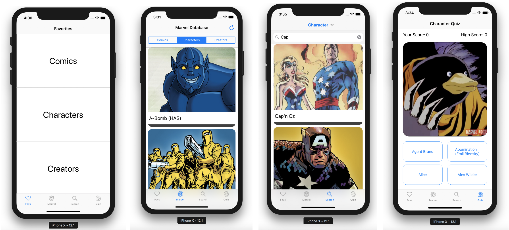
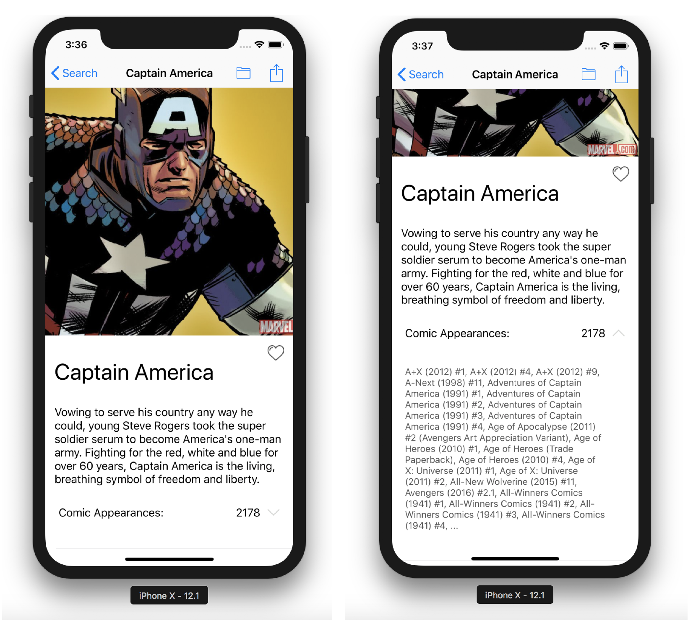

# ukc-ios-project
Project app for ios module during MSc degree Mobile Application Development at University of Kent Canterbury.

    

This project was developed in 11 days for the course "iPhone Application Design" during the Master degree "Mobile Application Development" at the University of Kent in Canterbury. The full project was implemented in **Swift**, and its outcome is shown in the document `"report.pdf"`.

The goal of this project was to build a complete iOS application, which views dynamic data from an API. The developed app should be able to demonstrate the skills learnt in this module.
Even though it was suggested to use the Flickr.com as an endpoint for the communication to retrieve dynamic data, this project focuses its communication on the Marvel API (https://developer.marvel.com).

## 📋 The basic requirements for the project were
- Retrieve dynamic data (text and images) from a remote source (Flickr API). i.e. Retrieve a list of the latest photos uploaded to Flickr.
- Present the dynamic data in a table, grid or similar using a UITableView or UICollectionView. i.e. Display thumbnails of latest photos on Flickr in a list with captions.
- Provide navigation between two or more different types of scenes driven by dynamic data. i.e. Tapping on a photo loads a high-resolution version with additional details.

Additionally, extended requirements were implemented. 
**This project was implemented and tested for an iPhone X.**

## ⭐️ Quick Overview
The result of this project is a fully functioning iOS application for iPhoneX, that shows all information stored in the Marvel API - therefore showing every `character`, `comic` and `creator` ever known in the Marvel Cinematic Universe. Additionally to exploring the data, the user can save information into his/her favorites, and search for explicit entries. Furthermore, the user can test his/her knowledge by participating in the characters quiz.

The app consists of 4 tabs

- Favs
- Marvel (Comics/Characters/Creators)
- Search
- Quiz

When clicking on one of the characters, the detailsview will show any further details stored in the Marvel API: 

## 📐 Report
You can find a detailed description of the project and its outcome in `report.pdf`.